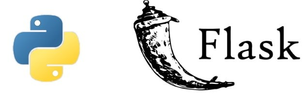

# Flask - Python Alura

> Nesta aula, aprendemos sobre o Flask, um microframework Python lançado em 2010 por Armin Ronacher, que se destaca pela simplicidade, rapidez e eficiência. O Flask foi projetado com um núcleo que contém apenas o essencial para rodar uma aplicação web, como as bibliotecas Jinja e Werkzeug, sendo altamente extensível, permitindo que você adicione bibliotecas conforme a necessidade do seu projeto.

### Ajustes e melhorias

O projeto ainda está em desenvolvimento e as próximas atualizações serão voltadas para as seguintes tarefas:

- [] Primeira Aplicação: Jogoteca
- [] Tarefa 2
- [] Tarefa 3
- [] Tarefa 4

## 💻 Pré-requisitos

Caso você também queira utilizar Python Flask, verifique se você atendeu aos seguintes requisitos:

- Você instalou a versão mais recente do `Python 3`
- Você tem uma IDE `Pycharm / VScode`
- Você instalou o Flask `pip install flask`.

## Curso feito pela Alura

> https://cursos.alura.com.br/course/flask-crie-webapp-python

